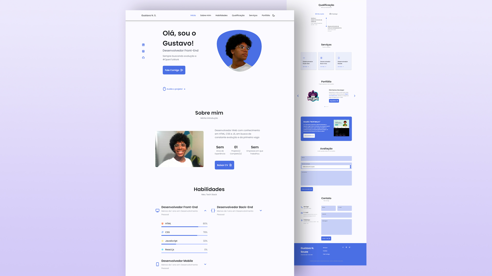

# Website Portfolio Responsivo
## Gustavo Nascimento Souza

Website de Portfolio Responsivo utilizando EJS, CSS, JavaScript e Node.js, com uma bela interface de usuário.

Contém: Header com Barra de Navegação, Início, Sobre mim, Habilidades, Qualificação, Serviços, Portfolio (Projetos realizados), Projeto em mente, Comentários, Contato e Footer.

## 🚀 Tecnologias

Esse projeto foi desenvolvido com as seguintes tecnologias:

- HTML
- CSS
- JavaScript
- [ScrollReveal](https://scrollrevealjs.org)

##  NodeJS

- [NodeJS](https://nodejs.org/en/)
- [NPM](https://www.npmjs.com)
- [EJS](https://www.npmjs.com/package/ejs)
- [Express](https://www.npmjs.com/package/express)
- [SQLite / SQLITE3](https://www.npmjs.com/package/sqlite)
- [Nodemailer](https://www.npmjs.com/package/nodemailer)
- [Nodemon](https://www.npmjs.com/package/nodemon) (Dependência DEV)

**Não esqueça de instalar as dependências acima**

## 💻 Projeto

O Website Portfolio Responsivo é uma aplicação pessoal de constante atualização, onde será feita a publicação e divulgação pessoal

## ✍ Quer criar e personalizar o seu Portfólio?

[Faça você mesmo!](https://youtu.be/27JtRAI3QO8)

<strong>Observação: </strong>
Use e abuse dos seus conhecimentos, insira Features, mais Elementos e Crie uma GitHub Page para seu Portfólio!

## 📝Licença

Esse projeto está sob a licença MIT. Veja o arquivo [LICENSE](./.github/LICENCE) para mais detalhes.

